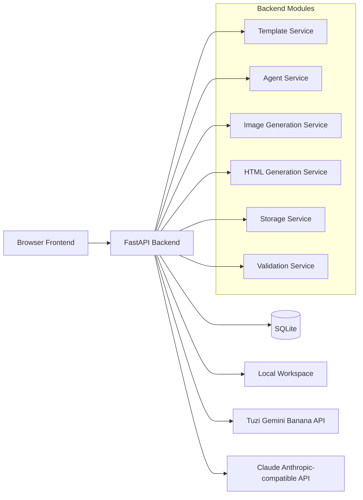

# 营销海报生成工具落地方案

> **给执行 Agent 的要求**：实现时必须先阅读 `重构方案.md`、`优化方案.md`、`图像批量生成/README.md`、`图像批量生成/server.py`，并以本文档中的接口契约为准。前端实现必须采用 `/frontend-design` 的设计标准，避免通用后台模板感。

## 1. 目标与边界

### 1.1 MVP 目标

构建一个 Python 后端 + 浏览器前端的本地 Web 工具，让普通用户在一个程序内完成：

1. 填写营销 Brief。
2. 由大模型整理视觉方案。
3. 用户确认方案。
4. 批量生成底图候选。
5. 用户选择满意底图。
6. 基于选中底图生成 HTML 海报。
7. 预览、轻量编辑、保存 HTML。
8. 按项目和活动分类保存底图、HTML、prompt 与版本记录。

### 1.2 MVP 不做

- 不接 Claude Code。
- 不做 PNG/JPG 导出。
- 不做完整拖拽式 HTML 编辑器。
- 不做多用户、权限、成本面板。
- 不做 OCR、背景移除、多类型文件查看器。
- 不做 Electron 桌面壳。

### 1.3 核心原则

- 用户填业务信息，不写 prompt。
- 先确认方案，再执行生成。
- 先批量生成底图，再由用户选择。
- 底图满意后再生成 HTML，避免串联失败。
- 所有模型输入、输出和失败原因都要留痕。
- 前后端通过稳定接口协作，方便拆给不同 Agent 并行实现。

## 2. 总体架构



### 2.1 推荐技术栈

后端：

- Python 3.11+
- FastAPI
- Pydantic v2
- SQLModel 或 SQLAlchemy 2.x
- SQLite
- httpx
- python-dotenv
- python-multipart
- aiofiles
- pytest

前端：

- React + Vite + TypeScript
- TanStack Query：接口请求和缓存
- Zustand：少量本地 UI 状态
- Monaco Editor 或 CodeMirror：HTML 源码编辑
- CSS Modules 或普通 CSS 变量体系
- 不建议第一版引入大型 UI 组件库

## 3. 项目目录建议

```text
mkt-material-tool/
  backend/
    app/
      main.py
      core/
        config.py
        errors.py
        security.py
      db/
        session.py
        models.py
        repositories.py
      schemas/
        common.py
        templates.py
        projects.py
        campaigns.py
        generation.py
        assets.py
        html.py
      services/
        template_service.py
        brief_agent.py
        prompt_agent.py
        review_agent.py
        image_provider_tuzi.py
        claude_provider.py
        storage_service.py
        html_validation.py
      api/
        routes_templates.py
        routes_projects.py
        routes_campaigns.py
        routes_generation.py
        routes_assets.py
        routes_html.py
    tests/
      test_state_machine.py
      test_storage_service.py
      test_html_validation.py
      test_prompt_agent.py
    pyproject.toml
    .env.example

  frontend/
    src/
      app/
        App.tsx
        routes.tsx
      api/
        client.ts
        types.ts
        templates.ts
        projects.ts
        generation.ts
        assets.ts
        html.ts
      components/
        Shell/
        Stepper/
        CandidateGrid/
        HtmlPreview/
        HtmlEditor/
        StatusBadge/
      pages/
        BriefPage.tsx
        PlanReviewPage.tsx
        ImageBatchPage.tsx
        HtmlGeneratePage.tsx
        HtmlEditorPage.tsx
        LibraryPage.tsx
      styles/
        tokens.css
        global.css
    package.json
    vite.config.ts

  workspace/
    projects/

  重构方案.md
  优化方案.md
  落地方案.md
```

## 4. 状态机

生成任务使用统一状态，前端展示和后端流转都基于这个状态。

```text
draft
-> brief_ready
-> plan_pending_review
-> plan_approved
-> image_generating
-> image_pending_selection
-> image_selected
-> html_generating
-> html_ready
-> editing
-> archived
```

失败统一记录：

```text
failed
```

失败时额外记录：

- `failed_stage`：失败发生阶段。
- `error_code`：机器可读错误码。
- `error_message`：用户可读错误。
- `raw_error`：调试用原始错误，可只存后端日志或数据库字段。

允许的重新生成入口：

- `plan_pending_review`：重新生成视觉方案。
- `image_pending_selection`：重新生成底图候选。
- `image_selected` 或 `html_ready`：基于同一底图重新生成 HTML。
- `editing`：保存新 HTML 版本。

## 5. 数据模型

### 5.1 Template

用途：保存活动类型和默认 prompt 组装规则。

字段：

- `id`
- `name`
- `description`
- `category`
- `default_size`
- `default_image_count`
- `brief_schema_json`
- `image_prompt_template`
- `html_prompt_template`
- `created_at`
- `updated_at`

MVP 内置模板：

- `节日祝福海报`
- `城市产业海报`
- `产品服务宣传海报`

### 5.2 Project

用途：项目级分类，例如“微众银行节日营销”。

字段：

- `id`
- `name`
- `description`
- `slug`
- `created_at`
- `updated_at`

### 5.3 Campaign

用途：一次具体活动，例如“五一劳动节造城者”。

字段：

- `id`
- `project_id`
- `template_id`
- `name`
- `status`
- `brief_json`
- `structured_plan_json`
- `approved_plan_json`
- `created_at`
- `updated_at`

### 5.4 GenerationTask

用途：记录一次方案、底图或 HTML 生成动作。

字段：

- `id`
- `campaign_id`
- `task_type`：`brief_plan` / `image_batch` / `html_generation` / `review`
- `status`
- `model`
- `provider`
- `input_json`
- `prompt_text`
- `output_json`
- `error_message`
- `created_at`
- `updated_at`

### 5.5 ImageAsset

用途：保存底图候选和选中底图。

字段：

- `id`
- `campaign_id`
- `generation_task_id`
- `kind`：`candidate` / `selected`
- `status`
- `remote_url`
- `local_path`
- `prompt_text`
- `model`
- `size`
- `width`
- `height`
- `selected_at`
- `created_at`

### 5.6 HtmlPoster

用途：保存 HTML 海报主记录。

字段：

- `id`
- `campaign_id`
- `selected_image_id`
- `title`
- `current_version_id`
- `status`
- `created_at`
- `updated_at`

### 5.7 HtmlVersion

用途：HTML 版本记录。

字段：

- `id`
- `poster_id`
- `version_no`
- `source`：`model` / `manual_edit` / `regenerate`
- `html_path`
- `prompt_text`
- `model`
- `validation_json`
- `created_at`

## 6. 文件保存规则

所有用户生成资产放在 `workspace/projects` 下。

```text
workspace/
  projects/
    <project_slug>/
      <campaign_slug>/
        brief/
          raw_brief.json
          approved_plan.json
        prompts/
          image_prompt_v001.txt
          html_prompt_v001.txt
        assets/
          candidates/
            image_v001_001.jpg
            image_v001_002.jpg
          selected/
            selected_image.jpg
        html/
          poster_v001.html
          poster_v002.html
        logs/
          generation_tasks.jsonl
```

命名规则：

- `project_slug` 使用项目名转拼音或安全短 ID。
- `campaign_slug` 使用活动名转拼音或安全短 ID。
- 候选图命名为 `image_v<批次号>_<序号>.<ext>`。
- HTML 命名为 `poster_v<版本号>.html`。
- 数据库保存相对路径，不保存绝对路径。

## 7. Banana 生图接口契约

### 7.1 接口来源

参考：

- `图像批量生成/server.py`
- `图像批量生成/index.html`
- Tuzi 文档：`gemini-3-pro-image-preview` 快速入门

MVP 采用异步接口：

- 创建任务：`POST {TUZI_API_BASE}/v1/videos`
- 查询任务：`GET {TUZI_API_BASE}/v1/videos/{task_id}`

### 7.2 环境变量

```env
TUZI_API_KEY=sk-xxx
TUZI_API_BASE=https://api.tu-zi.com
TUZI_IMAGE_MODEL=gemini-3-pro-image-preview-2k-async
```

### 7.3 创建任务请求

请求格式：`multipart/form-data`

字段：

- `model`：例如 `gemini-3-pro-image-preview-2k-async`
- `prompt`：底图 prompt
- `size`：例如 `9:16`、`16:9`、`1:1`
- `input_reference`：可选，支持多个同名字段

注意：

- 前端可以用 `9x16` 展示，但发给后端和 Tuzi 时必须转成 `9:16`。
- 多张参考图用重复字段 `input_reference`。
- 不把 Tuzi API Key 暴露给前端。

### 7.4 创建任务响应

兼容字段：

```json
{
  "id": "472886112156536836",
  "object": "video",
  "model": "gemini-3-pro-image-preview-2k-async",
  "status": "queued",
  "progress": 0,
  "created_at": 1769600979
}
```

后端解析任务 ID 时兼容：

- `id`
- `task_id`
- `job_id`

### 7.5 查询任务响应

```json
{
  "id": "472886112156536836",
  "object": "video",
  "progress": 100,
  "status": "completed",
  "video_url": "https://..."
}
```

结果 URL 兼容字段：

- `video_url`
- `url`
- `image_url`

状态兼容：

- `queued`
- `processing`
- `completed`
- `failed`

### 7.6 轮询策略

MVP 建议：

- 1K：每 10 秒轮询一次。
- 2K：每 15 秒轮询一次。
- 4K：每 20 秒轮询一次。
- 单个任务最多轮询 10 分钟。
- 批量生成时每张图独立记录进度和失败原因。

## 8. Claude HTML 生成接口契约

### 8.1 接口来源

MVP 使用标准 Anthropic Messages API，连接中转站时只替换 `baseURL`。

官方接口形态：

- `POST /v1/messages`
- 请求包含 `model`、`max_tokens`、`system`、`messages`
- 图像输入支持 content block，`type: "image"`，source 可为 URL 或 base64

### 8.2 环境变量

```env
ANTHROPIC_API_KEY=sk-xxx
ANTHROPIC_BASE_URL=https://your-claude-proxy.example.com
ANTHROPIC_MODEL=claude-sonnet-4-6
ANTHROPIC_MAX_TOKENS=12000
```

### 8.3 请求策略

优先使用 Python `anthropic` SDK；如果中转站 SDK 兼容性不稳定，则使用 `httpx` 直接请求标准 Anthropic HTTP 接口。

请求头：

```http
Content-Type: application/json
x-api-key: <ANTHROPIC_API_KEY>
anthropic-version: 2023-06-01
```

请求体示例：

```json
{
  "model": "claude-sonnet-4-6",
  "max_tokens": 12000,
  "system": "你是资深营销视觉设计师和前端工程师，只输出可保存的 HTML。",
  "messages": [
    {
      "role": "user",
      "content": [
        {
          "type": "text",
          "text": "根据视觉方案和选中底图生成单文件 HTML 海报..."
        },
        {
          "type": "image",
          "source": {
            "type": "url",
            "url": "https://..."
          }
        }
      ]
    }
  ],
  "temperature": 0.4
}
```

如果中转站不支持 URL 图片输入，后端下载选中底图并改用 base64：

```json
{
  "type": "image",
  "source": {
    "type": "base64",
    "media_type": "image/jpeg",
    "data": "<base64>"
  }
}
```

### 8.4 HTML 输出约束

Prompt 必须要求模型：

- 只输出 HTML，不输出解释。
- HTML 可以直接保存为 `.html`。
- 使用单文件结构：`<!doctype html>`、`<html>`、`<head>`、`<body>`。
- CSS 放在 `<style>`。
- 不允许外链脚本。
- 不允许内联 `<script>`。
- 必须使用选中底图。
- 必须匹配任务尺寸。
- 必须保留用户填写的关键文案字段。
- 图片引用统一使用后端提供的相对路径或 data URL 占位。

## 9. 后端 API 契约

所有接口返回统一结构：

```json
{
  "ok": true,
  "data": {},
  "error": null
}
```

错误结构：

```json
{
  "ok": false,
  "data": null,
  "error": {
    "code": "IMAGE_PROVIDER_TIMEOUT",
    "message": "底图生成超时，请稍后重试",
    "details": {}
  }
}
```

### 9.1 模板接口

`GET /api/templates`

返回：

```json
{
  "items": [
    {
      "id": "festival_poster",
      "name": "节日祝福海报",
      "description": "适合五一、端午、中秋、春节等节点",
      "default_size": "9:16",
      "default_image_count": 4
    }
  ]
}
```

### 9.2 创建活动

`POST /api/campaigns`

请求：

```json
{
  "project_name": "微众银行营销素材",
  "campaign_name": "五一劳动节造城者",
  "template_id": "city_industry_poster",
  "brief": {
    "festival": "五一劳动节",
    "audience": "制造业、科研、软件技术服务业企业主",
    "theme_hint": "造城者",
    "cities": ["深圳"],
    "manager_name": "杨嘉雯",
    "company_name": "微众银行",
    "visual_style": "明亮摄影融合风格",
    "size": "16:9"
  }
}
```

返回：

```json
{
  "campaign_id": "cmp_001",
  "status": "brief_ready"
}
```

### 9.3 生成视觉方案

`POST /api/campaigns/{campaign_id}/plan/generate`

返回：

```json
{
  "campaign_id": "cmp_001",
  "task_id": "task_plan_001",
  "status": "plan_pending_review",
  "structured_plan": {
    "campaignTheme": "造城者",
    "audienceInsight": "企业主希望被看见其行业价值",
    "visualStyle": "明亮摄影融合风格",
    "cityLogic": "城市地标 + 产业元素自然融合",
    "copyTone": "克制、真诚、有行业认同感",
    "layoutRules": {
      "textArea": "底部 1/4",
      "readability": "底部压暗或半透明色块"
    }
  }
}
```

### 9.4 确认视觉方案

`POST /api/campaigns/{campaign_id}/plan/approve`

请求：

```json
{
  "approved_plan": {
    "campaignTheme": "造城者",
    "visualStyle": "明亮摄影融合风格"
  }
}
```

返回：

```json
{
  "campaign_id": "cmp_001",
  "status": "plan_approved"
}
```

### 9.5 批量生成底图

`POST /api/campaigns/{campaign_id}/images/batches`

请求：

```json
{
  "count": 4,
  "size": "16:9",
  "model": "gemini-3-pro-image-preview-2k-async",
  "reference_asset_ids": []
}
```

返回：

```json
{
  "batch_id": "batch_001",
  "status": "image_generating",
  "items": [
    {
      "image_asset_id": "img_001",
      "provider_task_id": "472886112156536836",
      "status": "queued",
      "progress": 0
    }
  ]
}
```

### 9.6 查询底图批次

`GET /api/image-batches/{batch_id}`

返回：

```json
{
  "batch_id": "batch_001",
  "status": "image_pending_selection",
  "items": [
    {
      "image_asset_id": "img_001",
      "status": "completed",
      "progress": 100,
      "preview_url": "/api/assets/img_001/file",
      "local_path": "workspace/projects/demo/campaign/assets/candidates/image_v001_001.jpg",
      "error_message": null
    }
  ]
}
```

### 9.7 选择底图

`POST /api/campaigns/{campaign_id}/images/select`

请求：

```json
{
  "image_asset_id": "img_001"
}
```

返回：

```json
{
  "campaign_id": "cmp_001",
  "selected_image_id": "img_001",
  "status": "image_selected"
}
```

### 9.8 生成 HTML

`POST /api/campaigns/{campaign_id}/html/generate`

请求：

```json
{
  "selected_image_id": "img_001",
  "model": "claude-sonnet-4-6"
}
```

返回：

```json
{
  "poster_id": "poster_001",
  "version_id": "htmlver_001",
  "status": "html_ready",
  "preview_url": "/api/html/htmlver_001/preview",
  "validation": {
    "ok": true,
    "issues": []
  }
}
```

### 9.9 获取 HTML 内容

`GET /api/html/{version_id}`

返回：

```json
{
  "version_id": "htmlver_001",
  "poster_id": "poster_001",
  "html": "<!doctype html>..."
}
```

### 9.10 保存手动编辑版本

`POST /api/html/{poster_id}/versions`

请求：

```json
{
  "source": "manual_edit",
  "html": "<!doctype html>..."
}
```

返回：

```json
{
  "poster_id": "poster_001",
  "version_id": "htmlver_002",
  "version_no": 2,
  "validation": {
    "ok": true,
    "issues": []
  }
}
```

### 9.11 素材文件读取

`GET /api/assets/{asset_id}/file`

返回图片文件流。

### 9.12 HTML 沙箱预览

`GET /api/html/{version_id}/preview`

返回 `text/html`，前端用 iframe 加载。

前端 iframe 必须使用 sandbox：

```html
<iframe sandbox="allow-same-origin"></iframe>
```

不允许 `allow-scripts`，除非后续有明确需求。

## 10. 前端设计方案

### 10.1 `/frontend-design` 方向

界面不做普通后台管理系统。建议采用“营销战役工作台”视觉方向：

- 调性：高级编辑部 + 轻工业工作台。
- 关键词：沉稳、专业、带一点设计软件的仪式感。
- 色彩：暖白/墨黑为主，使用劳动红或鎏金作为强调色。
- 字体：中文优先使用系统可用的黑体/宋体组合；标题区域可使用更有海报感的字重和字距。
- 布局：左侧为任务阶段，右侧为当前创作画布，不做拥挤表格。
- 动效：底图生成槽位使用细腻进度 shimmer；确认方案、选择底图、保存版本要有明确反馈。

### 10.2 前端页面

#### BriefPage

功能：

- 选择模板。
- 填写活动名称、节日节点、目标客群、城市、客户经理、公司名、视觉风格、尺寸。
- 点击“生成视觉方案”。

依赖接口：

- `GET /api/templates`
- `POST /api/campaigns`
- `POST /api/campaigns/{campaign_id}/plan/generate`

#### PlanReviewPage

功能：

- 展示 Agent 生成的结构化视觉方案。
- 用户可编辑方案文本或结构化字段。
- 确认后进入底图生成。
- 不满意可重新生成方案。

依赖接口：

- `POST /api/campaigns/{campaign_id}/plan/approve`
- `POST /api/campaigns/{campaign_id}/plan/generate`

#### ImageBatchPage

功能：

- 展示底图 prompt 摘要。
- 设置生成数量、比例、模型。
- 并发生成底图。
- 每张图独立进度、失败状态、预览。
- 用户选择一张作为底图。
- 可重新生成一批。

依赖接口：

- `POST /api/campaigns/{campaign_id}/images/batches`
- `GET /api/image-batches/{batch_id}`
- `POST /api/campaigns/{campaign_id}/images/select`

#### HtmlGeneratePage

功能：

- 展示选中底图、视觉方案、文案字段。
- 点击生成 HTML。
- 生成完成后进入预览编辑页。

依赖接口：

- `POST /api/campaigns/{campaign_id}/html/generate`

#### HtmlEditorPage

功能：

- 左侧 iframe 预览。
- 右侧 Monaco/CodeMirror HTML 编辑器。
- 保存为新版本。
- 查看版本列表。
- 基于当前底图重新生成 HTML。

依赖接口：

- `GET /api/html/{version_id}`
- `GET /api/html/{version_id}/preview`
- `POST /api/html/{poster_id}/versions`
- `POST /api/campaigns/{campaign_id}/html/generate`

#### LibraryPage

功能：

- 查看项目、活动、底图、HTML。
- 按状态筛选。
- 打开已有活动继续编辑。

依赖接口：

- `GET /api/projects`
- `GET /api/campaigns`
- `GET /api/campaigns/{campaign_id}`

## 11. Agent 拆分执行方案

以下任务可以拆给不同 Agent 并行执行，但必须共享本文档的 API 和类型契约。

### Agent A：后端基础与数据模型

职责：

- 搭建 `backend/` FastAPI 项目。
- 实现配置读取。
- 建立 SQLite 数据模型。
- 实现统一响应和错误结构。
- 实现模板、项目、活动基础 CRUD。

交付：

- `backend/app/main.py`
- `backend/app/core/config.py`
- `backend/app/db/models.py`
- `backend/app/db/session.py`
- `backend/app/schemas/*.py`
- `backend/app/api/routes_templates.py`
- `backend/app/api/routes_projects.py`
- `backend/app/api/routes_campaigns.py`
- 基础测试。

不得实现：

- Tuzi 调用。
- Claude 调用。
- 前端页面。

### Agent B：Banana 生图 Provider 与批量任务

职责：

- 参考 `图像批量生成/server.py` 实现 Tuzi 异步生图 Provider。
- 支持 `POST /v1/videos`、`GET /v1/videos/{id}`。
- 支持重复 `input_reference`。
- 支持 `size` 冒号格式。
- 支持批量生成和轮询状态落库。
- 下载远程图片到本地 workspace。

交付：

- `backend/app/services/image_provider_tuzi.py`
- `backend/app/services/storage_service.py`
- `backend/app/api/routes_generation.py`
- `backend/app/api/routes_assets.py`
- Provider 单元测试。

统一约束：

- 不暴露 Tuzi API Key 给前端。
- 兼容 `id`、`task_id`、`job_id`。
- 兼容 `video_url`、`url`、`image_url`。

### Agent C：Claude Provider、Prompt Agent 与 HTML 校验

职责：

- 实现 Brief Agent。
- 实现 Prompt Agent。
- 实现 Claude Anthropic-compatible Provider。
- 实现 HTML 生成和保存。
- 实现最小 HTML 安全校验。

交付：

- `backend/app/services/brief_agent.py`
- `backend/app/services/prompt_agent.py`
- `backend/app/services/claude_provider.py`
- `backend/app/services/html_validation.py`
- `backend/app/api/routes_html.py`
- Prompt 和 HTML 校验测试。

统一约束：

- Claude 使用标准 Anthropic Messages API。
- `ANTHROPIC_BASE_URL` 可配置。
- 生成 HTML 不允许 `<script>`。
- 输出必须保存为版本，不覆盖旧版本。

### Agent D：前端设计系统与基础页面壳

职责：

- 使用 `/frontend-design` 标准设计 UI。
- 搭建 Vite + React + TypeScript。
- 实现全局布局、阶段导航、视觉 tokens。
- 实现 API client 和类型定义。

交付：

- `frontend/src/app/App.tsx`
- `frontend/src/app/routes.tsx`
- `frontend/src/api/client.ts`
- `frontend/src/api/types.ts`
- `frontend/src/styles/tokens.css`
- `frontend/src/styles/global.css`
- `frontend/src/components/Shell/*`
- `frontend/src/components/Stepper/*`

统一约束：

- 不使用通用后台模板视觉。
- 不把 API Key 放前端。
- 以 `api/types.ts` 为前后端共享契约镜像。

### Agent E：前端核心工作流页面

职责：

- 实现 Brief、方案确认、底图批量生成、HTML 生成页面。
- 复用 `图像批量生成/index.html` 的槽位进度体验，但调整主动作为“选择底图”。

交付：

- `frontend/src/pages/BriefPage.tsx`
- `frontend/src/pages/PlanReviewPage.tsx`
- `frontend/src/pages/ImageBatchPage.tsx`
- `frontend/src/pages/HtmlGeneratePage.tsx`
- `frontend/src/components/CandidateGrid/*`
- `frontend/src/api/generation.ts`

统一约束：

- 批量底图页面必须支持单槽位失败展示。
- 用户选择底图后才允许生成 HTML。
- 用户可重新生成底图候选。

### Agent F：HTML 预览编辑与素材库

职责：

- 实现 iframe 沙箱预览。
- 实现 Monaco/CodeMirror 编辑器。
- 实现保存版本。
- 实现素材库基础浏览。

交付：

- `frontend/src/pages/HtmlEditorPage.tsx`
- `frontend/src/pages/LibraryPage.tsx`
- `frontend/src/components/HtmlPreview/*`
- `frontend/src/components/HtmlEditor/*`
- `frontend/src/api/html.ts`
- `frontend/src/api/assets.ts`

统一约束：

- iframe 不允许脚本执行。
- 保存编辑必须生成新版本。
- 素材库第一版只做基础查看和继续编辑。

### Agent G：集成测试与验收

职责：

- 校验端到端流程。
- 校验失败恢复。
- 校验 HTML 安全规则。
- 编写手工验收清单。

交付：

- `backend/tests/`
- `frontend` 基础测试或 Playwright 冒烟测试。
- `验收清单.md`

## 12. 测试与验收

### 12.1 后端单元测试

必须覆盖：

- 状态机合法流转。
- 文件路径生成。
- Tuzi 响应字段兼容。
- Claude HTML 结果提取。
- HTML 禁止脚本校验。
- 保存版本不覆盖旧版本。

### 12.2 前端冒烟测试

必须覆盖：

- 创建活动。
- 生成视觉方案。
- 确认方案。
- 创建底图批次。
- 底图槽位展示完成和失败。
- 选择底图。
- 生成 HTML。
- 编辑 HTML 并保存版本。

### 12.3 人工验收

第一轮使用五一案例验收：

- 活动主题：造城者。
- 风格：明亮摄影融合。
- 城市：深圳或北京。
- 底图要求：城市地标 + 产业氛围，无文字。
- HTML 要求：文字可读，底图正确，保存版本可回看。

## 13. 建议执行顺序

1. 后端基础与数据模型。
2. Tuzi Banana Provider。
3. Claude Provider 与 Prompt Agent。
4. 前端设计系统与路由。
5. Brief/方案/底图生成工作流。
6. HTML 预览编辑。
7. 素材库。
8. 集成测试和验收清单。

## 14. 人工执行命令建议

这些命令只供后续实现阶段由人工执行或由你明确授权后执行。

### 安装后端依赖

为什么：创建 FastAPI 后端运行环境。

如何：

```powershell
cd backend
python -m pip install -e ".[dev]"
```

### 启动后端

为什么：本地开发时提供 API。

如何：

```powershell
cd backend
uvicorn app.main:app --reload --host 127.0.0.1 --port 8765
```

### 安装前端依赖

为什么：准备 React/Vite 前端开发环境。

如何：

```powershell
cd frontend
npm install
```

### 启动前端

为什么：本地浏览器访问应用界面。

如何：

```powershell
cd frontend
npm run dev
```

## 15. 关键风险

### 15.1 Claude 中转站兼容性

风险：中转站虽然说标准 Anthropic 接口，但可能对图片 URL、base64、多模态字段支持不完整。

处理：

- Provider 层必须封装。
- 先支持 URL image block。
- 失败后自动 fallback 到 base64 image block。
- 保留原始请求和错误摘要，方便调试。

### 15.2 Banana 任务耗时与失败

风险：2K/4K 生图可能需要 2-5 分钟，并且可能失败。

处理：

- 每张图独立状态。
- 用户看到每个槽位进度。
- 失败不影响其它候选图。
- 允许重新生成一批。

### 15.3 HTML 安全

风险：模型生成不安全脚本或外链资源。

处理：

- 保存前做基础校验。
- iframe 沙箱不允许脚本。
- Prompt 明确禁止 `<script>`。
- 后端校验失败时不设为当前版本。

### 15.4 前端复杂度失控

风险：HTML 编辑器走向 Capybara 式复杂可视化编辑。

处理：

- MVP 只做源码编辑 + 预览。
- 不做 DOM 树。
- 不做拖拽式布局。
- 半可视化编辑放到 `优化方案.md` 的后续阶段。

## 16. 完成定义

MVP 视为完成时，需要满足：

- 用户能创建一个活动。
- 用户能让 Agent 生成并确认视觉方案。
- 用户能批量生成至少 4 张底图候选。
- 用户能选择一张底图。
- 用户能基于底图生成 HTML 海报。
- 用户能预览 HTML。
- 用户能编辑 HTML 并保存新版本。
- 底图、HTML、prompt、模型参数、生成状态都被保存。
- 失败状态可见，并能从关键阶段重试。
