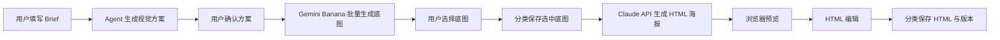

# Python 后端重构方案

## 背景判断

当前 `实现功能.md` 描述的 Capybara 更像一个“AI 文档/文件预览桌面工作台”，包含多标签、集成终端、文件监听、Markdown/PDF/Image 查看器、OCR、背景移除、MCP、复杂 HTML 可视化编辑器等能力。

这些能力展示了大量前端复杂工作，但和当前核心诉求相比偏重。真正需要解决的是：让普通用户以低门槛方式生成营销海报素材，并能分类保存底图和 HTML。

核心链路应收敛为：



## 产品定位

这个产品的核心不是 HTML 编辑器，而是一个“营销海报生成工作流产品”。

MVP 的目标是：

> 让用户填写业务信息，系统自动生成专业级视觉方案、底图提示词和 HTML 海报，并允许用户在关键节点确认和选择。

用户不应该直接写复杂 prompt，也不应该操作 Claude Code。系统需要把 prompt 工程产品化：用户填的是业务信息，程序负责组装成稳定、可执行的模型指令。

## 推荐架构

采用“Python 后端 + 轻量浏览器前端”的 Web-first 架构。

- 后端：FastAPI，负责调用中转站 Gemini Banana 生图接口、调用 Claude Sonnet/Opus 生成 HTML、组织文件目录、保存任务记录。
- 前端：React/Vite 或更轻的模板前端，负责表单、任务列表、底图候选选择、素材库、HTML 预览、源码编辑。
- 存储：先用本地文件系统 + SQLite，避免一开始引入对象存储、队列、复杂账号系统。
- 编辑：先做“预览 + Monaco/CodeMirror 源码编辑 + 保存版本”，不做复杂拖拽式 DOM 编辑器。
- 分类：按项目、活动、渠道、日期、状态保存底图和 HTML，目录结构与数据库记录保持一致。

## 分段式生成流程

不建议从“用户输入”一路自动生成到底图和 HTML。底图生成有随机性，也存在审美差异。如果底图不满意，后续 HTML 再好也很难补救。

因此生成流程应拆成几个阶段：

1. 用户填写基础 Brief。
2. Brief Agent 润色并结构化成视觉方案。
3. 用户确认视觉方案。
4. Prompt Agent 生成底图 prompt。
5. 系统并发生成一批底图候选。
6. 用户从候选底图中选择满意结果。
7. 系统基于选中的底图生成 HTML 海报。
8. 用户在预览编辑页做轻量修改。
9. 保存 HTML、底图和版本记录。

这样可以在底图生成完成后插入一次人机交互，缩短用户心理等待时间，也避免“一次性跑完后发现底图不行”的浪费。

## 可复用参考

现有 `图像批量生成` 小工具可以作为底图批量生成页的参考。

值得复用的能力包括：

- FastAPI 本地代理，避免 API Key 暴露到浏览器。
- 并发提交多张图像生成任务。
- 每个槽位独立展示进度、失败状态和结果图。
- 网格预览生成结果。
- 支持参考图上传。
- 支持比例选择。

新工具中的主动作需要调整：

- 从“下载图片”变成“选为底图”。
- 增加“重新生成这一批”。
- 增加“保存候选”和“保存选中结果”。
- 选中底图后进入 HTML 生成阶段。

## MVP 页面范围

第一版建议只做 6 个页面/模块：

1. Brief/方案页  
   用户填写海报需求、活动名称、目标客群、城市/行业、尺寸、风格偏好、个性化字段。Agent 将其整理为结构化视觉方案，用户确认后再执行。

2. 底图批量生成页  
   并发生成多张底图，显示每张的独立进度、失败状态、预览与选择按钮。

3. 素材库  
   按项目、活动、日期查看底图，支持重命名、删除、复制路径、查看关联 HTML。

4. HTML 生成页  
   选择已确认底图和视觉方案，调用 Claude Sonnet/Opus 生成 HTML 海报。

5. 预览编辑页  
   左侧 iframe 预览，右侧 HTML/CSS 源码编辑，支持保存版本、恢复历史版本、必要时重新生成。

6. 项目归档页  
   按分类查看底图、HTML、导出文件和历史版本。

## MVP 必须先定的底层约定

以下内容不需要在第一版做得很复杂，但必须在架构和数据设计阶段先定下来。否则后续实现批量生成、重新生成、版本保存时容易返工。

### 活动模板

活动模板应该作为核心资产保存，而不是只保存单次生成结果。

MVP 可以先内置少量模板，例如：

- 节日祝福海报。
- 城市产业海报。
- 产品/服务宣传海报。

模板先不需要复杂的可视化编辑能力，只需要定义：

- 默认 Brief 表单字段。
- 默认视觉风格。
- 默认尺寸。
- 默认文案结构。
- 底图 prompt 组装规则。
- HTML prompt 组装规则。

这样未来做五一、端午、中秋、春节等活动时，可以复用同一套工作流，而不是每次重新设计 prompt。

### 任务状态机

生成任务需要明确状态，避免前端和后端对“现在进行到哪一步”理解不一致。

MVP 建议使用以下状态：

```text
draft
-> brief_ready
-> plan_pending_review
-> plan_approved
-> image_generating
-> image_pending_selection
-> image_selected
-> html_generating
-> html_ready
-> editing
-> archived
```

失败状态可以统一记录为：

```text
failed
```

同时记录失败发生在哪个阶段，例如 `image_generating` 或 `html_generating`。这样用户可以从失败点继续，而不是从头重来。

### 重新生成粒度

MVP 至少需要支持三种重新生成：

- 重新生成视觉方案：适用于用户觉得策略方向不对。
- 重新生成底图候选：适用于方案认可，但图不满意。
- 基于同一张底图重新生成 HTML：适用于底图满意，但版式或文案排版不满意。

每次重新生成都应该产生新版本，而不是覆盖旧结果。这样用户可以回退，也方便后续比较 prompt 效果。

### Prompt 与生成结果留痕

每次生成都应该保存完整上下文。

至少保存：

- 用户原始表单。
- Agent 整理后的视觉方案。
- 底图生成 prompt。
- HTML 生成 prompt。
- 使用的模型名称。
- 关键模型参数。
- 生成时间。
- 生成状态。
- 输出文件路径。
- 失败原因。

这些记录不一定第一版就做成复杂界面，但数据库或文件中必须留存。这个项目后续最有价值的资产，很可能就是这些被验证过的 prompt 模板和生成记录。

### 最小 HTML 安全与结构校验

Claude 生成 HTML 后，后端需要做最小校验。

MVP 校验范围：

- 必须是完整 HTML 文档或可渲染的 HTML 片段。
- 必须使用选中的底图。
- 不允许外链脚本。
- 不允许内联危险脚本。
- 尺寸必须符合当前任务要求。
- 样式应尽量内联或集中在 `<style>` 中，便于保存和编辑。
- 文字内容不能缺失关键字段，例如城市、活动标题、客户经理姓名等。

Review Agent 可以负责语义和规范检查；后端代码负责基础安全检查。

### 暂不考虑导出能力

MVP 暂不做 PNG/JPG 导出，也不优先考虑 Playwright 截图导出。第一版先把 HTML 生成、预览、编辑、保存闭环跑通。

## Agent 设计

MVP 不做全能 Agent，而是拆成三个明确阶段。

### Brief Agent

负责把用户填写的简单表单润色成完整营销视觉方案。

输入示例：

- 活动名称
- 节日/营销节点
- 目标客群
- 城市/行业
- 文案诉求
- 视觉风格
- 输出尺寸

输出示例：

```json
{
  "campaignTheme": "造城者",
  "audienceInsight": "企业主希望被看见其行业价值",
  "visualStyle": "明亮摄影融合风格",
  "cityLogic": "城市地标 + 产业元素自然融合",
  "copyTone": "克制、真诚、有行业认同感",
  "layoutRules": {
    "textArea": "底部 1/4",
    "titlePosition": "右下或下沿",
    "readability": "底部压暗或半透明色块"
  }
}
```

### Prompt Agent

负责把确认后的视觉方案拆成两个 prompt：

- 底图生成 prompt：用于 Gemini Banana，强调画面、构图、风格、比例、禁用文字等。
- HTML 生成 prompt：用于 Claude Sonnet/Opus，强调版式、文字层级、尺寸、底图使用方式、可读性、保存规范。

### Review Agent

负责检查生成结果是否满足规范。

检查点包括：

- HTML 尺寸是否正确。
- 是否使用选中的底图。
- 是否包含危险脚本。
- 文字是否落在可读区域。
- 是否符合用户确认过的视觉方案。
- 是否有明显缺字段。

## HTML 编辑定位

HTML 编辑功能需要保留，但应定位为轻量修改，而不是完整可视化页面搭建器。

MVP 建议支持：

- iframe 沙箱预览。
- Monaco 或 CodeMirror 源码编辑。
- 编辑后实时刷新预览。
- 保存版本。
- 恢复历史版本。
- 重新调用模型生成。

暂不建议做：

- GrapesJS 级拖拽页面搭建。
- DOM 树编辑器。
- 复杂样式面板。
- 元素拖拽和自由布局。

这样既保留用户微调能力，又避免项目重新走向 Capybara 的复杂前端路线。

## 关键技术决策

- `ImageGenerationProvider`：先接中转站 Gemini Banana，未来可替换模型供应商。
- `HtmlGenerationProvider`：MVP 先接 Claude Sonnet/Opus API；Claude Code 不进入 MVP 主流程，未来仅作为高级 Provider。
- `BriefAgent`、`PromptAgent`、`ReviewAgent`：后端统一管理 prompt 模板和模型参数，前端只暴露表单和确认界面。
- 底图生成必须支持批量候选、单张选择、重新生成、保存候选与保存选中结果。
- HTML 预览必须用 iframe 沙箱隔离，防止生成 HTML 影响主应用页面。
- 文件路径建议固定为 `workspace/projects/<project>/<campaign>/assets` 与 `workspace/projects/<project>/<campaign>/html`，数据库只保存元数据与相对路径。

## 交付形态

开发阶段先做本地 Web：

- Python 后端运行在本地。
- 浏览器访问 `localhost`。
- API Key 放在后端环境变量或配置文件中。
- 本地文件系统保存素材。

后期可扩展为两种交付方式：

1. 打包 exe  
   用 PyInstaller 或 Nuitka 打包 Python 后端，内置前端静态文件，启动后自动打开浏览器。体验接近“双击打开工具”。

2. 部署服务器  
   同一套 FastAPI 后端部署到服务器，前端构建为静态文件。需要额外补充用户登录、权限、对象存储或共享文件盘、任务隔离。

## 暂不建议保留的复杂功能

- 不保留集成终端。
- MVP 不接 Claude Code。
- 不保留多类型文件查看器。
- 不保留 OCR 和背景移除，除非业务明确需要。
- 不优先做 GrapesJS 级可视化编辑器。
- 不保留 Electron 主体，除非后续必须做强桌面化能力。

## 下一步

如果确认这个方向，下一步应继续细化：

1. 数据模型：项目、活动、生成任务、底图候选、选中底图、HTML 海报、版本记录。
2. 任务状态机：每个阶段的状态、失败恢复方式、重新生成入口。
3. 本地文件保存规则：目录结构、命名规则、候选图和最终图的关系。
4. API 草案：Brief 生成、底图批量生成、底图选择、HTML 生成、HTML 保存、预览读取。
5. 前端页面草图：Brief 页、底图候选页、HTML 预览编辑页、素材库。
6. 模型 prompt 模板：Brief Agent、Prompt Agent、Review Agent 的输入输出格式。
